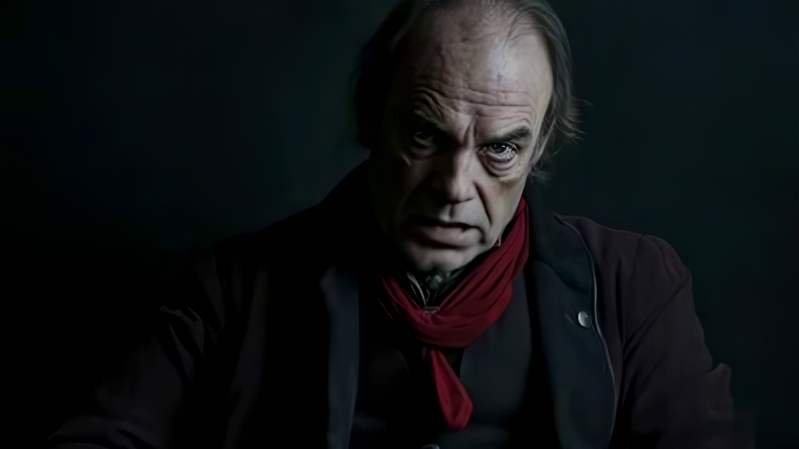
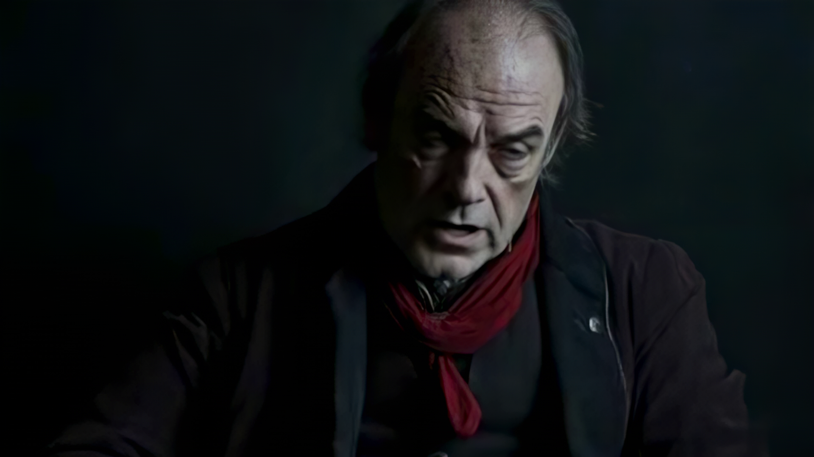

## Abstract

This paper evaluates the emotional resonance and fidelity of video generated by state-of-the-art Generative AI (GenAI) models. Through a structured focus group session with film industry professionals, we assess the performance of Wan2.1, Hunyuan-Video, and Runway models across text-to-video and audio-driven generation tasks. While current generative architectures achieve high visual quality, we find significant limitations in their capacity to express subtle, complex human emotions. We examine these constraints, mapping the evolution of model architectures and detailing the specific emotional expression deficits observed during user trials, highlighting key areas for future research in responsible and creative AI.

## Experiment Videos

Compare the emotional expressions generated by Runway and Wan2.1 against the original actor references and input images across different categories:

### Anger Expression

<div style="display: flex; gap: 1.5rem; margin-bottom: 1.5rem; flex-wrap: wrap;">
  <div style="background: var(--md-code-bg-color); border-radius: 8px; border: 1px solid var(--md-divider-color); padding: 0.75rem; display: flex; flex-direction: column; gap: 0.25rem;">
    <span style="font-weight: bold; font-size: 0.8rem; color: var(--md-typeset-color);">Actor Reference (Original)</span>
    <video src="videos/actor_anger.mp4" controls style="width: 360px; height: 202px; border-radius: 4px; border: 1px solid var(--md-divider-color); object-fit: cover;"></video>
  </div>
  <div style="background: var(--md-code-bg-color); border-radius: 8px; border: 1px solid var(--md-divider-color); padding: 0.75rem; display: flex; flex-direction: column; gap: 0.25rem;">
    <span style="font-weight: bold; font-size: 0.8rem; color: var(--md-typeset-color);">GenAI Input (Reference)</span>
    
  </div>
</div>

<div class="table-responsive">
<table style="table-layout: fixed; width: 100%;">
  <thead>
    <tr>
      <th style="width: 10%; text-align: left;">Model</th>
      <th style="width: 380px; text-align: center;">Video</th>
      <th style="text-align: left;">Expert #1 Comments</th>
      <th style="text-align: left;">Expert #2 Comments</th>
    </tr>
  </thead>
  <tbody>
    <tr>
      <td><strong>Runway</strong></td>
      <td style="text-align: center;"><video src="videos/Model_A_anger_cleaned.mp4" controls style="width: 360px; height: 202px; border-radius: 4px; border: 1px solid var(--md-divider-color); object-fit: cover;"></video></td>
      <td>High visual quality and resolution, but the character has a relatively static face with a blank stare, lacking emotional micro-expressions.</td>
      <td>The anger feels superficial; the character's facial muscles do not contract realistically to match high-intensity rage.</td>
    </tr>
    <tr>
      <td><strong>Wan2.1</strong></td>
      <td style="text-align: center;"><video src="videos/Model_B_anger_cleaned.mp4" controls style="width: 360px; height: 202px; border-radius: 4px; border: 1px solid var(--md-divider-color); object-fit: cover;"></video></td>
      <td>Face warping and distortion under high-intensity emotion. The jaw and mouth area show artifacting.</td>
      <td>The animation breaks suspension of disbelief due to temporal inconsistencies and facial stretching.</td>
    </tr>
  </tbody>
</table>
</div>

### Joy Expression

<div style="display: flex; gap: 1.5rem; margin-bottom: 1.5rem; flex-wrap: wrap;">
  <div style="background: var(--md-code-bg-color); border-radius: 8px; border: 1px solid var(--md-divider-color); padding: 0.75rem; display: flex; flex-direction: column; gap: 0.25rem;">
    <span style="font-weight: bold; font-size: 0.8rem; color: var(--md-typeset-color);">Actor Reference (Original)</span>
    <video src="videos/actor_joy.mp4" controls style="width: 360px; height: 202px; border-radius: 4px; border: 1px solid var(--md-divider-color); object-fit: cover;"></video>
  </div>
  <div style="background: var(--md-code-bg-color); border-radius: 8px; border: 1px solid var(--md-divider-color); padding: 0.75rem; display: flex; flex-direction: column; gap: 0.25rem;">
    <span style="font-weight: bold; font-size: 0.8rem; color: var(--md-typeset-color);">GenAI Input (Reference)</span>
    
  </div>
</div>

<div class="table-responsive">
<table style="table-layout: fixed; width: 100%;">
  <thead>
    <tr>
      <th style="width: 10%; text-align: left;">Model</th>
      <th style="width: 380px; text-align: center;">Video</th>
      <th style="text-align: left;">Expert #1 Comments</th>
      <th style="text-align: left;">Expert #2 Comments</th>
    </tr>
  </thead>
  <tbody>
    <tr>
      <td><strong>Runway</strong></td>
      <td style="text-align: center;"><video src="videos/Model_A_joy_cleaned.mp4" controls style="width: 360px; height: 202px; border-radius: 4px; border: 1px solid var(--md-divider-color); object-fit: cover;"></video></td>
      <td>High aesthetic appeal, but the smile feels fake or "plastic", failing to engage the eyes (Duchenne smile deficit).</td>
      <td>Looks like a stock photo animated; lacks the warm, natural transitions of genuine joy.</td>
    </tr>
    <tr>
      <td><strong>Wan2.1</strong></td>
      <td style="text-align: center;"><video src="videos/Model_B_joy_cleaned.mp4" controls style="width: 360px; height: 202px; border-radius: 4px; border: 1px solid var(--md-divider-color); object-fit: cover;"></video></td>
      <td>Struggles to keep facial structure stable while smiling, leading to melting or warping.</td>
      <td>Poor temporal coherence around the teeth and lips.</td>
    </tr>
  </tbody>
</table>
</div>

### Encouragement / Motivation

<div style="display: flex; gap: 1.5rem; margin-bottom: 1.5rem; flex-wrap: wrap;">
  <div style="background: var(--md-code-bg-color); border-radius: 8px; border: 1px solid var(--md-divider-color); padding: 0.75rem; display: flex; flex-direction: column; gap: 0.25rem;">
    <span style="font-weight: bold; font-size: 0.8rem; color: var(--md-typeset-color);">Actor Reference (Original)</span>
    <video src="videos/actor_encouragement.mp4" controls style="width: 360px; height: 202px; border-radius: 4px; border: 1px solid var(--md-divider-color); object-fit: cover;"></video>
  </div>
  <div style="background: var(--md-code-bg-color); border-radius: 8px; border: 1px solid var(--md-divider-color); padding: 0.75rem; display: flex; flex-direction: column; gap: 0.25rem;">
    <span style="font-weight: bold; font-size: 0.8rem; color: var(--md-typeset-color);">GenAI Input (Reference)</span>
    
  </div>
</div>

<div class="table-responsive">
<table style="table-layout: fixed; width: 100%;">
  <thead>
    <tr>
      <th style="width: 10%; text-align: left;">Model</th>
      <th style="width: 380px; text-align: center;">Video</th>
      <th style="text-align: left;">Expert #1 Comments</th>
      <th style="text-align: left;">Expert #2 Comments</th>
    </tr>
  </thead>
  <tbody>
    <tr>
      <td><strong>Runway</strong></td>
      <td style="text-align: center;"><video src="videos/Model_A_encouragement_updated.mp4" controls style="width: 360px; height: 202px; border-radius: 4px; border: 1px solid var(--md-divider-color); object-fit: cover;"></video></td>
      <td>Steady head pose, but the eyes remain dead and unresponsive.</td>
      <td>The motivational expression is flat and robotic, lacking the nuance of a trained actor.</td>
    </tr>
    <tr>
      <td><strong>Wan2.1</strong></td>
      <td style="text-align: center;"><video src="videos/Model_B_encoragement_updated.mp4" controls style="width: 360px; height: 202px; border-radius: 4px; border: 1px solid var(--md-divider-color); object-fit: cover;"></video></td>
      <td>Accurate lip-syncing but fails to connect vocal intensity with upper facial expressions.</td>
      <td>Distortions occur in the cheek area during larger head movements.</td>
    </tr>
  </tbody>
</table>
</div>

### Grateful Expression

<div style="display: flex; gap: 1.5rem; margin-bottom: 1.5rem; flex-wrap: wrap;">
  <div style="background: var(--md-code-bg-color); border-radius: 8px; border: 1px solid var(--md-divider-color); padding: 0.75rem; display: flex; flex-direction: column; gap: 0.25rem;">
    <span style="font-weight: bold; font-size: 0.8rem; color: var(--md-typeset-color);">Actor Reference (Original)</span>
    <video src="videos/actor_grateful.mp4" controls style="width: 360px; height: 202px; border-radius: 4px; border: 1px solid var(--md-divider-color); object-fit: cover;"></video>
  </div>
  <div style="background: var(--md-code-bg-color); border-radius: 8px; border: 1px solid var(--md-divider-color); padding: 0.75rem; display: flex; flex-direction: column; gap: 0.25rem;">
    <span style="font-weight: bold; font-size: 0.8rem; color: var(--md-typeset-color);">GenAI Input (Reference)</span>
    
  </div>
</div>

<div class="table-responsive">
<table style="table-layout: fixed; width: 100%;">
  <thead>
    <tr>
      <th style="width: 10%; text-align: left;">Model</th>
      <th style="width: 380px; text-align: center;">Video</th>
      <th style="text-align: left;">Expert #1 Comments</th>
      <th style="text-align: left;">Expert #2 Comments</th>
    </tr>
  </thead>
  <tbody>
    <tr>
      <td><strong>Runway</strong></td>
      <td style="text-align: center;"><video src="videos/Model_A_grateful_cleaned.mp4" controls style="width: 360px; height: 202px; border-radius: 4px; border: 1px solid var(--md-divider-color); object-fit: cover;"></video></td>
      <td>The emotional tone is lost, resulting in a neutral or blank look rather than gratitude.</td>
      <td>The character doesn't show the micro-expressions of vulnerability or emotion.</td>
    </tr>
    <tr>
      <td><strong>Wan2.1</strong></td>
      <td style="text-align: center;"><video src="videos/Model_B_grateful_cleaned.mp4" controls style="width: 360px; height: 202px; border-radius: 4px; border: 1px solid var(--md-divider-color); object-fit: cover;"></video></td>
      <td>Cross-modal mismatch; voice is trembling and emotional, but the eyes are completely vacant.</td>
      <td>The model cannot animate subtle eye movements (like welling up) to match the audio.</td>
    </tr>
  </tbody>
</table>
</div>

## BibTeX Citation

```bibtex
@article{guedes2026cangenai,
  title={Evaluation and Societal Discussion of Emotion Fidelity of AI-generated Human Avatars},
  author={Guedes, Alan},
  journal={AI \& SOCIETY},
  publisher={Springer},
  year={2026}
}
```
